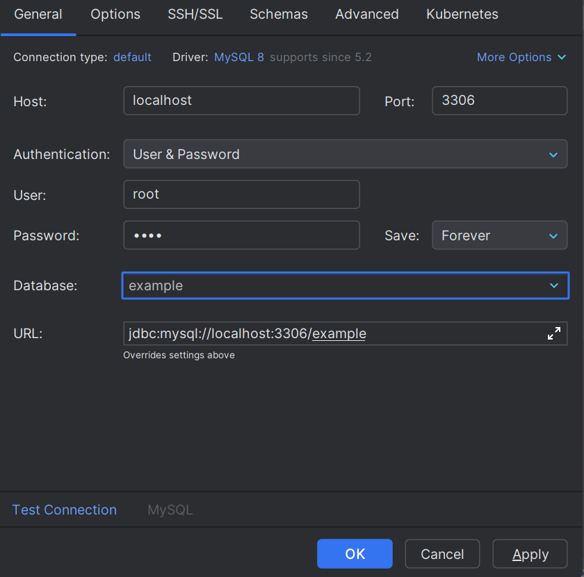
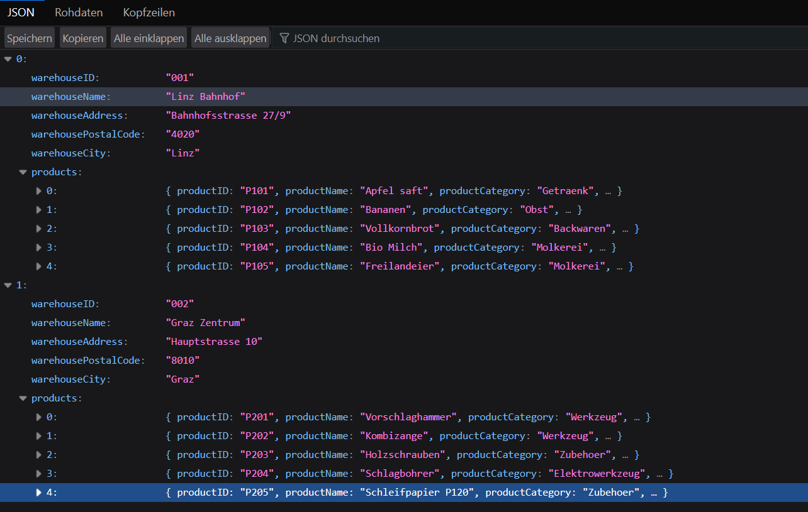

# DEZSYS_GK81_WAREHOUSE_ORM

Dominik Orsolic 4CHIT

## Lösungsweg
### Schritt 1
MySQL Datenbank erstellen und mit IntelliJ verbinden. Dafür muss die application.properties Datei mit den entsprechenden Datenbankinformationen gefüllt werden:
```properties
spring.application.name=warehouse-orm
spring.jpa.hibernate.ddl-auto=update
spring.datasource.url=jdbc:mysql://localhost:3306/example
spring.datasource.username=root
spring.datasource.password=root
spring.datasource.driver-class-name=com.mysql.cj.jdbc.Driver
spring.jpa.show-sql=true
```
Jetzt verbinden mit View -> Tool Windows -> Database -> + -> MySQL. Hier die Datenbankinformationen eingeben und auf OK klicken.

Test Connection anklicken, um die Verbindung zu überprüfen. Falls erfolgreich, ist die Datenbank erfolgreich verbunden.

Um zu testen, ob die Verbindung funktioniert:
```bash
curl.exe -X POST "http://localhost:8080/demo/add" -d "name=John" -d "email=john@example.com"                                                        
```
Das sollte eine neue Zeile in der Datenbanktabelle "users" erstellen.

Testen:
```bash
curl.exe http://localhost:8080/demo/all
```
Ausgabe:
```json
{"id":1,"name":"John","email":"john@example.com"
```
Die Datenbankverbindung funktioniert, da die Daten korrekt zurückgegeben werden.

## Schritt 2
Die fehlenden Klassen und Methoden ergänzen, die man aus der Datenstruktur ablesen kann:
### WarehouseData
```java
@Entity
public class WarehouseData {

    @Id
    private String warehouseID;
    private String warehouseName;
    private String warehouseAddress;
    private String warehousePostalCode;
    private String warehouseCity;

    @OneToMany(mappedBy = "warehouseData", cascade = CascadeType.ALL)
    private List<ProductData> products;

    // Getter & Setter
    
}
```
Die benötigten Attribute können aus der Datenstruktur aus dem Kurs abgelesen werden. Zusätzlich hat diese Klasse noch eine Liste an Producten, diese hat eine OneToMany Beziehung zu ProductData, da ein Lager mehrere Produkte enthalten kann.

### ProductData
```java
@Entity
public class ProductData {

    @Id
    private String productID;
    private String productName;
    private String productCategory;
    private int productQuantity;
    private String productUnit;

    @ManyToOne
    @JoinColumn(name = "warehouse_id")
    private WarehouseData warehouseData;

    // Getter & Setter
}
```
Die Attribute können ebenfalls aus der Datenstruktur abgelesen werden. Zusätzlich hat diese Klasse eine ManyToOne Beziehung zu WarehouseData, da ein Produkt nur in einem Lager enthalten sein kann.

### Repositories
```java
public interface WarehouseRepository extends CrudRepository<WarehouseData, String> { }
```
```java
public interface ProductRepository extends CrudRepository<ProductData, String> { }
```
Für jede Entity wurde ein eigenes Repository erstellt, da jede Tabelle separat verwaltet wird und CRUD-Operationen unabhängig durchgeführt werden müssen. Die Repositories erweitern `CrudRepository`, um die grundlegenden CRUD-Methoden bereitzustellen, ohne dass diese manuell implementiert werden müssen.

## Schritt 3
Neue Endpoints in den Controllern erstellen, um die CRUD-Operationen für WarehouseData und ProductData zu ermöglichen:
```java
@PostMapping("/warehouse")
public @ResponseBody String addWarehouse(...) {
    WarehouseData w = new WarehouseData();
    ...
    warehouseRepository.save(w);
    return "Warehouse saved";
}
```
Mit diesem Endpoint können neue Warehouses erstellt und in der Datenbank gespeichert werden.

```java
@GetMapping("/warehouses")
public @ResponseBody Iterable<WarehouseData> getWarehouses() {
    return warehouseRepository.findAll();
}
```
Dieser Endpoint gibt alle Warehouses zurück, die in der Datenbank gespeichert sind.

```java
@PostMapping("/product")
public @ResponseBody String addProduct(...) {
    ...
}
```
Hier wird ein Produkt erstellt und gleichzeitig einem Warehouse zugeordnet.

## Schritt 4
### Testen
2 Warehouses erstellen:
```bash
$body1 = @{
    warehouseID = "001"
    warehouseName = "Linz Bahnhof"
    warehouseAddress = "Bahnhofsstrasse 27/9"
    warehousePostalCode = "4020"
    warehouseCity = "Linz"
} | ConvertTo-Json

Invoke-RestMethod -Uri "http://localhost:8080/demo/warehouse" -Method Post -ContentType "application/json" -Body $body1
```

```bash
$body2 = @{
    warehouseID = "002"
    warehouseName = "Graz Zentrum"
    warehouseAddress = "Hauptstrasse 10"
    warehousePostalCode = "8010"
    warehouseCity = "Graz"
} | ConvertTo-Json

Invoke-RestMethod -Uri "http://localhost:8080/demo/warehouse" -Method Post -ContentType "application/json" -Body $body2
```

Jeweils 5 Produkte für die Warehouses erstellen:
```bash
Invoke-RestMethod -Uri "http://localhost:8080/demo/product" -Method Post -ContentType "application/json" -Body '{"productID":"P101","productName":"Apfelsaft","productCategory":"Getraenk","productQuantity":500,"productUnit":"Liter","warehouseData":{"warehouseID":"001"}}'
Invoke-RestMethod -Uri "http://localhost:8080/demo/product" -Method Post -ContentType "application/json" -Body '{"productID":"P102","productName":"Bananen","productCategory":"Obst","productQuantity":200,"productUnit":"kg","warehouseData":{"warehouseID":"001"}}'
Invoke-RestMethod -Uri "http://localhost:8080/demo/product" -Method Post -ContentType "application/json" -Body '{"productID":"P103","productName":"Vollkornbrot","productCategory":"Backwaren","productQuantity":50,"productUnit":"Stk","warehouseData":{"warehouseID":"001"}}'
Invoke-RestMethod -Uri "http://localhost:8080/demo/product" -Method Post -ContentType "application/json" -Body '{"productID":"P104","productName":"Bio Milch","productCategory":"Molkerei","productQuantity":300,"productUnit":"Liter","warehouseData":{"warehouseID":"001"}}'
Invoke-RestMethod -Uri "http://localhost:8080/demo/product" -Method Post -ContentType "application/json" -Body '{"productID":"P105","productName":"Freilandeier","productCategory":"Molkerei","productQuantity":1000,"productUnit":"Stk","warehouseData":{"warehouseID":"001"}}'
```
```bash
Invoke-RestMethod -Uri "http://localhost:8080/demo/product" -Method Post -ContentType "application/json" -Body '{"productID":"P201","productName":"Vorschlaghammer","productCategory":"Werkzeug","productQuantity":20,"productUnit":"Stk","warehouseData":{"warehouseID":"002"}}'
Invoke-RestMethod -Uri "http://localhost:8080/demo/product" -Method Post -ContentType "application/json" -Body '{"productID":"P202","productName":"Kombizange","productCategory":"Werkzeug","productQuantity":15,"productUnit":"Stk","warehouseData":{"warehouseID":"002"}}'
Invoke-RestMethod -Uri "http://localhost:8080/demo/product" -Method Post -ContentType "application/json" -Body '{"productID":"P203","productName":"Holzschrauben","productCategory":"Zubehoer","productQuantity":5000,"productUnit":"Pkg","warehouseData":{"warehouseID":"002"}}'
Invoke-RestMethod -Uri "http://localhost:8080/demo/product" -Method Post -ContentType "application/json" -Body '{"productID":"P204","productName":"Schlagbohrer","productCategory":"Elektrowerkzeug","productQuantity":10,"productUnit":"Stk","warehouseData":{"warehouseID":"002"}}'
Invoke-RestMethod -Uri "http://localhost:8080/demo/product" -Method Post -ContentType "application/json" -Body '{"productID":"P205","productName":"Schleifpapier P120","productCategory":"Zubehoer","productQuantity":100,"productUnit":"Blatt","warehouseData":{"warehouseID":"002"}}'
```

Schauen ob die Daten korrekt in der Datenbank gespeichert wurden:
```bash
 curl.exe http://localhost:8080/demo/warehouses   
```
-> JSON wird zurückgegeben.

oder im browser: http://localhost:8080/demo/warehouses


-> Alles wurde richtig geseichert.

## Aufgetretene Probleme
* **Zu neue Java Version**: Es gab Probleme mit der Java Version, da die verwendete Version zu neu war. Das Problem wurde gelöst, indem die Java Version auf 17 geändert wurde:
  * ````properties
    toolchain {
        languageVersion = JavaLanguageVersion.of(17)
    }

* **Endlose Schleife**: Eine gegenseitige Verknüpfung führte beim Abrufen von Daten zu einer Endlosschleife, wodurch tausende Produkte zurückgegeben wurden. Dieses Problem habe ich durch die Annotation `@JsonProperty(access = JsonProperty.Access.WRITE_ONLY)` gelöst.

## Questions

* What is ORM and how is JPA used? 
    * ORM (Object-Relational Mapping): A technique to map object-oriented disk structures (Java Classes) to relational database structures (SQL Tables).
    * JPA (Jakarta Persistence API): A Java specification that provides a standard for ORM. It uses annotations to define how objects are persisted.
* What is the application.properties used for and where must it be stored?  
  * It stores configuration settings like database credentials, URL, and JPA behavior.
  * It must be stored in `src/main/resources/`.
* Which annotations are frequently used for entity types? Which key points must be observed?   
  * `@Entity`: Defines the class as a database table.
  * `@Id`: Marks the primary key.
  * `@GeneratedValue`: Configures ID generation (e.g., IDENTITY).
  * `@OneToMany` / `@ManyToOne`: Defines the relationship between entities.
* What methods do you need for CRUD operations?  
  * `save(entity)`: Create or Update.
  * `findById(id)`: Read a specific record.
  * `findAll()`: Read all records.
  * `deleteById(id)`: Remove a record.

## Links

* Object Relational Mapping (ORM) Data Access:   
   https://docs.spring.io/spring-framework/reference/data-access/orm.html
* Accessing data with MySQL.  
   https://spring.io/guides/gs/accessing-data-mysql
* Accessing Data with JPA   
   https://spring.io/guides/gs/accessing-data-jpa
* Difference between Hibernate and Spring Data:  
   https://dzone.com/articles/what-is-the-difference-between-hibernate-and-sprin-1
* Introduction Hibernate:   
   https://vicksheet.medium.com/getting-started-with-hibernate-an-introduction-to-the-orm-framework-for-java-applications-fd97af01b7a6
* Video:   
   https://www.youtube.com/watch?v=NC-1j1grMPI&ab_channel=ManningPublications
